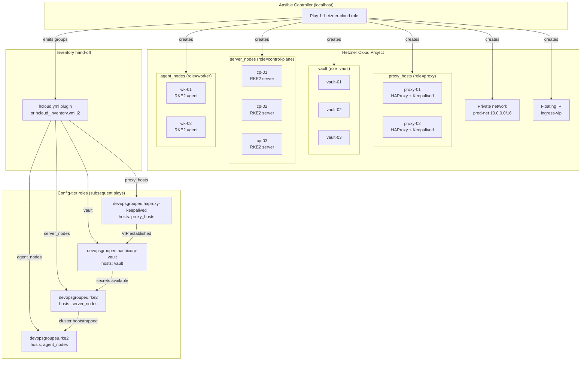

# Architecture

Infrastructure topology and provisioning flow for `ansible-role-hetzner-cloud`.

---

## Provisioning flow

This role runs controller-side (`connection: local`, `become: false`). It makes
API calls to Hetzner Cloud to create resources, then emits an inventory so
downstream config-tier roles can target the newly provisioned hosts.



---

## Inventory group contract

The role assigns servers to inventory groups based on the `role` label applied
at server creation time. Label *values* are fixed; group *names* are the
consumer roles' expected names:

| Hetzner label | Inventory group | Consumer role |
|---|---|---|
| `role=control-plane` | `server_nodes` | `devopsgroupeu.rke2` |
| `role=worker` | `agent_nodes` | `devopsgroupeu.rke2` |
| `role=proxy` | `proxy_hosts` | `devopsgroupeu.haproxy-keepalived` |
| `role=vault` | `vault` | `devopsgroupeu.hashicorp-vault` |

The dynamic inventory plugin (`hcloud.yml`) uses a `groups:` map to produce
these names. The static template (`templates/hcloud_inventory.yml.j2`) uses
the same mapping. Either hand-off produces an inventory that downstream roles
consume without modification.

---

## Resource creation order

Resources are created in dependency order within a single play:

1. SSH keys
2. Networks → subnetworks
3. Firewalls
4. Placement groups
5. Servers (reference SSH keys, firewalls, placement groups)
6. Server-network attachments (reference servers and networks)
7. Primary IPs / floating IPs
8. Volumes
9. Load balancers (optional, alternative to self-hosted HAProxy)
10. Outputs: set `hcloud_provisioned_servers` fact; render static inventory

---

## Config-tier stack order

The downstream plays form a config-tier dependency chain:

```
hetzner-cloud (provision)
    → haproxy-keepalived (VIP)
        → hashicorp-vault (Raft behind VIP)
            → rke2 servers
                → rke2 agents (serial: 1)
                    → in-cluster ESO / Vault Agent
```

Vault must come after haproxy because the Vault `vault_api_addr` points at the
HAProxy VIP. RKE2 must come after vault so the join token and TLS secrets are
available from Vault at cluster bootstrap.
