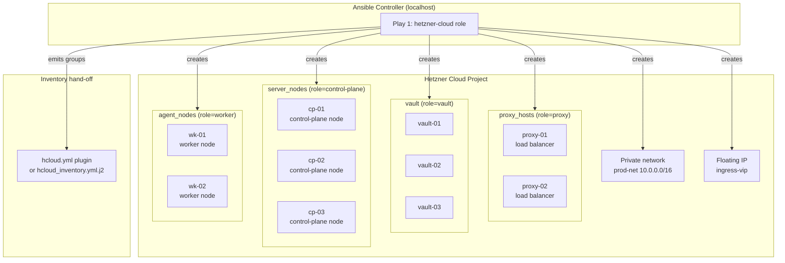

# Architecture

Infrastructure topology and provisioning flow for `ansible-role-hetzner-cloud`.

---

## Provisioning flow

This role runs controller-side (`connection: local`, `become: false`). It makes
API calls to Hetzner Cloud to create resources, then emits an inventory so
downstream config-tier roles can target the newly provisioned hosts.

---

## Inventory group contract

The role assigns servers to inventory groups based on the `role` label applied
at server creation time. Label *values* and group *names* are illustrative
examples — choose whatever names your downstream plays consume:

| Hetzner label | Inventory group (example) |
|---|---|
| `role=control-plane` | `server_nodes` |
| `role=worker` | `agent_nodes` |
| `role=proxy` | `proxy_hosts` |
| `role=vault` | `vault` |

The dynamic inventory plugin (`hcloud.yml`) uses a `groups:` map to produce
these names. The static template (`templates/hcloud_inventory.yml.j2`) uses
the same mapping. Either hand-off produces an inventory that downstream plays
consume without modification.

---

## Resource creation order

Resources are created in dependency order within a single play:

1. SSH keys
2. Networks → subnetworks
3. Firewalls
4. Placement groups
5. Servers (reference SSH keys, firewalls, placement groups)
6. Server-network attachments (reference servers and networks)
7. Primary IPs / floating IPs
8. Volumes
9. Load balancers (optional, alternative to a self-hosted load balancer)
10. Outputs: set `hcloud_provisioned_servers` fact; render static inventory
